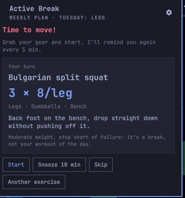
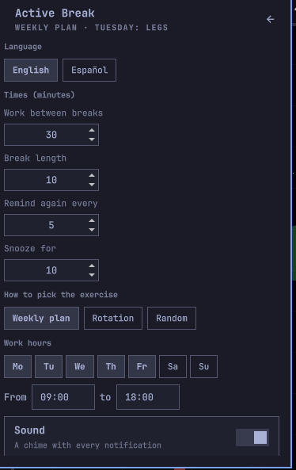
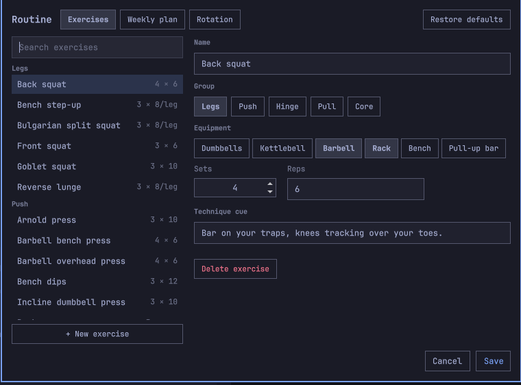

# Active Break

A bar plugin for [Omarchy](https://omarchy.org) that turns your breaks into
short workouts. After a stretch of work (30 min by default) it tells you to
stop and which exercise to do with your dumbbells, kettlebells or barbell, and
times the break (10 min by default). If you ignore it, it keeps reminding you
every 5 minutes until you start, snooze or skip.



## What it does

- **Countdown in the bar.** A kettlebell with the minutes left until the next
  break. It turns red when it's time to move, and shows minutes and seconds
  during the break.
- **Reminders.** A notification with a chime that names the exercise, sets ×
  reps and equipment. It stays on screen until you act: Start, Snooze or Skip
  close it. Click it to open the panel. If you ignore it, it chimes again every
  5 minutes, replacing the previous one instead of stacking. When the break
  ends, another notification tells you when the next one is.
- **It picks the exercise for you.** There are three modes, chosen in
  Settings:
  - *Weekly plan*: each day has a focus (Monday push, Tuesday legs…) and its
    list is worked through in order.
  - *Rotation*: cycles legs → push → hinge → pull → core.
  - *Random*: anything from the catalog, never the previous one.
- **Work hours.** It only counts on the days and hours you set (Monday to
  Friday, 09:00–18:00 by default). For meetings, there's a manual pause.

It never locks your screen and doesn't log what you did.

## Install

```bash
omarchy plugin add https://github.com/FerC10110/omarchy-active-break.git --enable
```

That clones it into `~/.config/omarchy/plugins/io.github.ferc10110.active-break`
and puts the widget in the bar. To move it, use `omarchy bar move
io.github.ferc10110.active-break --section right`; to get a newer version,
`omarchy plugin update io.github.ferc10110.active-break`.

Nothing else is needed: it uses `omarchy-notification-send` for reminders and
`pw-play` for the chime.

## Use


| In the bar | Action |
| --- | --- |
| Left click | Opens the panel |
| Right click | Pauses or resumes |
| Middle click | Starts the break now |

The panel shows the current phase, the next exercise (or the current one), and
the buttons that fit each moment:

| Phase | Buttons |
| --- | --- |
| Working | Start now, Pause, Another exercise |
| Time to move | Start, Snooze 10 min, Skip, Another exercise |
| Break | Done, Another exercise |
| Paused | Resume |

"Another exercise" helps when the equipment is busy. In rotation mode it picks
another exercise from the same muscle group.

How it behaves:

- If the computer was suspended or off for longer than a break, the work cycle
  starts over when you're back.
- A manual pause lasts until you resume or until the next day.
- If you change the minutes or the mode in Settings, the running cycle adjusts
  when you save.

### From the terminal or a keybinding

Everything is available over IPC:

```bash
omarchy-shell io.github.ferc10110.active-break status        # JSON with the phase, exercise and times
omarchy-shell io.github.ferc10110.active-break startBreak
omarchy-shell io.github.ferc10110.active-break togglePause
# also: snooze, skip, finishBreak, pause, resume, reroll, editRoutine
```

For example, to pause with a keybinding in `~/.config/hypr/bindings.lua`:

```lua
o.bind("SUPER + ALT + G", "Active Break: pause", "omarchy-shell io.github.ferc10110.active-break togglePause")
```

And one to open the routine editor:

```lua
o.bind("SUPER + ALT + SHIFT + G", "Active Break: edit routine", "omarchy-shell io.github.ferc10110.active-break editRoutine")
```

## Settings



The cog in the panel sets:

- the minutes of work, break, reminder interval and snooze
- the mode
- the days and hours
- the chime

The first row picks the language: **English** or **Español**. It is not part of
this plugin's settings — it is written to `~/.config/omarchy/plugin-language.json`
and shared by every plugin that reads it, so changing it here changes them all.
Without that file, everything is in English.

They're saved to `~/.config/active-break/config.json`, which you can also edit by hand.

## Routine

The routine is the catalog of exercises, each day's plan and the rotation
order. It starts with 28 exercises for dumbbells, kettlebells, an Olympic
barbell with a rack, a bench and a pull-up bar.

Exercise names and technique cues are your data: they stay exactly as you
wrote them, in whatever language, no matter what the language setting is.
Only the interface around them gets translated.

The routine you start with is mine, though, so it ships in both languages.
Whichever one is set when the plugin first runs is the one you get, and
**Restore defaults** in the editor brings back the routine in the language set
at that moment. Switching language never rewrites a routine you already have.

To change it, click **Edit routine** in Settings (the cog in the panel), or run
`omarchy-shell io.github.ferc10110.active-break editRoutine`. The editor opens in the
middle of the screen with three tabs:

- **Exercises**: add, edit or delete exercises: name, muscle group, equipment,
  sets, reps and a technique cue. Deleting one also takes it out of the plan.
- **Weekly plan**: each day's focus and the exercises it goes through, in
  order.
- **Rotation**: the order of the muscle groups in rotation mode, and which ones
  take part.



Nothing is written until you click **Save** (or press Ctrl+S). Cancel or Esc
asks before throwing changes away. **Restore defaults** brings back the
original routine — in the language you are using — and it still needs a Save.

### Demo images

The panel can show a small looping image of the exercise, above its name. The
plugin ships none: put your own in `~/.config/active-break/media/`, one file
per exercise, named after its id — `back-squat.gif`, `push-ups.gif`. GIFs of
about 180×180 fit the panel without scaling. An exercise with no file just has
no image, and the card closes up around it.

To find an exercise's id, open `routine.json`: it is the `id` field. New files
are picked up while the shell is running.

Settings links to one collection of exercise animations. Whatever you use, the
images belong to whoever made them: ask before you use them, and download them
yourself — this plugin never fetches or bundles any.

### The file

The editor writes `~/.config/active-break/routine.json`. You can also edit it by hand:
changes apply as soon as you save the file.

```json
{
  "exercises": [
    { "id": "kettlebell-swing", "name": "Kettlebell swing", "group": "hinge", "equipment": ["kettlebell"],
      "sets": 4, "reps": "15", "cue": "The hips throw the bell, the arms only guide it." }
  ],
  "plan": {
    "mon": { "focus": "Push", "exercises": ["bench-press", "push-ups"] }
  },
  "rotation": ["legs", "push", "hinge", "pull", "core"]
}
```

What each field means:

- **`group`** is one of `legs`, `push`, `hinge`, `pull` or `core`. Other values
  work too if you add them to `rotation`.
- **`equipment`** uses `dumbbells`, `kettlebell`, `barbell`, `rack`, `bench` or
  `pullup_bar`. Empty means bodyweight.
- **`plan`** has one key per day: `mon`, `tue`, `wed`, `thu`, `fri`, `sat`,
  `sun`.
  - A day without a plan uses the whole catalog.
  - Ids that don't exist are ignored.

To start over, use **Restore defaults** in the editor.

## Files

- `~/.config/active-break/config.json`: the settings.
- `~/.config/active-break/routine.json`: the exercises and the plan.
- `~/.config/active-break/media/`: your demo images, if you want them.
- `~/.local/state/active-break/state.json`: the clock (phase and times). Delete it to
  start a fresh cycle.
- `~/.config/omarchy/plugin-language.json`: the language, shared with my other
  plugins. Delete it to go back to English.

## Remove

```bash
omarchy plugin disable io.github.ferc10110.active-break
omarchy plugin remove io.github.ferc10110.active-break
rm -r ~/.config/active-break ~/.local/state/active-break
```

## Development

The plugin has two parts:

- **`Service.qml`** is a single instance that owns the clock, the reminders,
  the files and IPC.
- **`BarWidget.qml`**, the panel and the routine editor only display it and call into it.

The logic (state machine, work hours, exercise picking and texts) is plain
JavaScript in `BreakModel.js`:

```bash
node --test tests/
```

The bar reloads plugins on any change in this folder, including the service.
That's why the clock is always saved as wall-clock timestamps: it survives
those reloads.

That reload doesn't apply code changes, because the shell caches compiled QML
components. After editing a `.qml` file or `BreakModel.js`, run `omarchy restart
shell`, and never while the screen is locked, since the lock screen lives in
the same shell.

`Service.qml` only imports Quickshell, so it can also be tested on its own:
launch a `quickshell -p` with a `ShellRoot` that instantiates it, and point
`XDG_CONFIG_HOME` and `XDG_STATE_HOME` at a temporary directory.

## License

MIT
